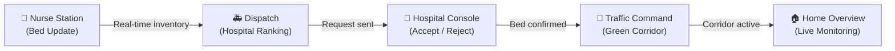
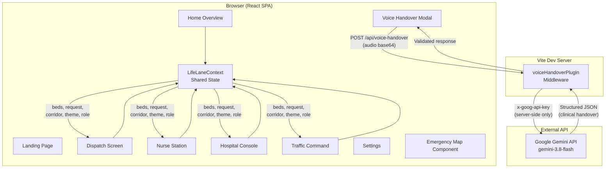

# 🚑 LifeLane — Every Second Has a Destination

> **Team:** Code Cartel (T34)
> **Problem Statement:** PS5 — Healthtech: BedLink
> **Domain:** Health Tech

---

## 📋 Project Overview

LifeLane is a real-time emergency coordination platform that connects **ambulance crews**, **hospitals**, and **traffic command** into one unified interface. When a critical patient is in transit, every second counts — LifeLane ensures the nearest hospital with the right bed is identified, a bed is confirmed and held before arrival, and a signal-preempted traffic corridor is deployed to reduce transit time.

The application is built as a React single-page application with a Vite development server. It provides role-based dashboards for two user roles — **Ambulance Staff** and **Hospital Staff** — each with access to the screens relevant to their operational responsibilities.

---

## 🎯 Problem Statement

> **PS5. Healthtech: BedLink** — An ambulance crew with a critical patient needs the nearest hospital that has the right bed (ICU, ventilator, oxygen, or a specialty such as cardiac or burns) right now. Build BedLink with three parts:
>
> 1. A **10-second bed-update screen** for hospital nurses (one tap per bed type, works on a cheap phone).
> 2. A **dispatch screen** that takes the patient's needs and location and ranks hospitals by bed match, estimated travel time, data freshness and current load.
> 3. A **confirm-and-hold step** where the chosen hospital accepts or rejects within 2 minutes, the bed is held for the ambulance, and the next-best hospital is offered automatically on rejection or timeout. Every listing shows how many minutes old its data is.

---

## 💡 Solution — How LifeLane Addresses the Problem

LifeLane implements all three parts of the problem statement and extends the workflow with AI-powered voice handover, a custom emergency map, and a simulated traffic corridor system.

### End-to-End Emergency Workflow



1. **Nurse Station** — Hospital nurses update bed availability (ICU, Ventilator, Oxygen, Cardiac, Burns) with one-tap increment/decrement controls. A "Confirm Accurate" button resets the data freshness timer. Every bed listing across the system shows how many minutes old its data is.

2. **Dispatch** — Ambulance staff see the patient's needs and location, then review a ranked list of hospitals scored by bed match, estimated travel time, data freshness, and current load. The ambulance crew selects a hospital and sends an emergency request.

3. **Hospital Console** — The receiving hospital sees the incoming request with patient vitals, clinical handover data, and an assigned bay. A **2-minute countdown timer** starts. The hospital can **Accept** (bed is confirmed and held for the ambulance) or **Reject** (the bed is released and the next-best hospital can be offered). If the timer expires, the request times out.

4. **Traffic Command** — When the hospital accepts, the Green Corridor becomes ready. Traffic command deploys signal preemption along the ambulance's route, reducing transit time. The corridor can be activated or emergency-stopped.

5. **Home Overview** — A unified dashboard showing active operations, corridor status, and recent activity across the emergency.

---

## ✨ Key Features

| Feature | Description |
|---|---|
| **One-Tap Bed Updates** | Nurses update ICU, Ventilator, Oxygen, Cardiac, and Burns beds with single-tap controls. Designed for speed and simplicity. |
| **Data Freshness Tracking** | Every bed listing shows how many minutes ago the data was last confirmed. A "Confirm Accurate" button resets the freshness timer. |
| **Hospital Ranking Engine** | Dispatch ranks hospitals by bed match, estimated travel time (with and without Green Corridor), data freshness, and distance. |
| **Confirm-and-Hold Workflow** | 2-minute countdown timer for hospital acceptance. Bed status transitions: Provisional → Confirmed (on accept) or Released (on reject/timeout). |
| **AI Voice Handover** | Ambulance paramedics record a voice handover that is transcribed and structured into clinical fields by Google Gemini. The structured data is reviewed, edited, and sent to the hospital. |
| **Custom Emergency Map** | A fully custom SVG-based emergency zone map with ambulance position, hospital nodes, emergency routes, traffic signals, road arteries, and corridor visualization. Supports pan, zoom, and recenter. |
| **Green Corridor Simulation** | Simulated traffic signal preemption that models reduced ETA, preempted signals, and cross-traffic holds along the ambulance route. |
| **Role-Based Access** | Two roles (Ambulance Staff, Hospital Staff) with separate screen access. Role is persisted in localStorage. |
| **Dark / Light Theme** | Full theme system with persistence. Theme is applied before first paint via an inline script to prevent flash. |
| **Cinematic Landing Page** | A 292-frame scroll-driven animation with overlay layers introducing LifeLane's capabilities. |

---

## 🛠 Technology Stack

| Layer | Technology |
|---|---|
| **Frontend** | React 18, TypeScript, Vite 6 |
| **Styling** | Tailwind CSS 4, Vanilla CSS (Landing page) |
| **Icons** | Lucide React |
| **Fonts** | Inter, Instrument Serif, JetBrains Mono, Fraunces (Google Fonts) |
| **AI / Voice** | Google Gemini API (gemini-3.8-flash) — audio understanding + structured JSON output |
| **Backend** | Vite dev server plugin (custom middleware for `/api/voice-handover`) |
| **Map** | Fully custom SVG-based emergency zone map (no external map SDK) |
| **State** | React Context API with localStorage persistence |

---

## 🏗 Architecture



### Key Architecture Decisions

- **Server-Side API Key**: The Gemini API key is stored in `.env` and loaded exclusively on the server via the Vite plugin. It is **never exposed to the client**. The client sends audio to `/api/voice-handover`, and the server proxies the request to Gemini using the `x-goog-api-key` header.
- **No Audio Storage**: Voice recordings are converted to Base64, sent to Gemini for transcription, and immediately discarded. No audio is persisted on disk or in the browser.
- **Demo Data**: All bed inventories, patient vitals, hospital information, traffic signal states, and corridor metrics are simulated mock data within the React context. There are no real-time external hospital, traffic, or GPS integrations.
- **No Authentication**: The application does not implement user authentication. Role switching is handled via a UI dropdown and persisted in localStorage.

---

## 📡 API Information

### Gemini API (Voice Handover)

| Detail | Value |
|---|---|
| **Provider** | Google Generative Language API |
| **Model** | `gemini-3.8-flash` |
| **Endpoint** | `https://generativelanguage.googleapis.com/v1beta/models/{MODEL}:generateContent` |
| **Auth** | `x-goog-api-key` header (server-side only) |
| **Input** | Audio (WebM/Opus or fallback) as inline Base64 + structured extraction prompt |
| **Output** | Structured JSON with clinical fields: patient, situation, onset, vitals, assessment, treatment, allergies, history, consciousness, missingFields |
| **Safety** | Zero-fabrication prompt rules: Gemini must not invent clinical data. Missing fields are explicitly tracked. Server-side validation enforces vital ranges (HR 20–300, SpO2 40–100, BP format). |
| **Resilience** | 60s timeout, retry on 503 with exponential backoff (max 3 attempts), client timeout at 65s. |

### Internal API

| Endpoint | Method | Description |
|---|---|---|
| `/api/voice-handover` | POST | Accepts `{ audioBase64, mimeType }`, proxies to Gemini, returns validated structured handover. |

---

## ⚙️ Setup & Installation

### Prerequisites

- **Node.js** ≥ 18
- **npm** (bundled with Node.js)
- A **Google Gemini API key** (for Voice Handover functionality)

### Installation

```bash
# Clone the repository
git clone <repository-url>
cd LifeLane

# Install dependencies
npm install
```

### Environment Configuration

Create a `.env` file in the project root with the following variables:

```env
GEMINI_API_KEY=<your-gemini-api-key>
GEMINI_MODEL=gemini-3.8-flash
```

> ⚠️ **Important**: The `.env` file is gitignored and must never be committed. The API key is loaded server-side only and is never sent to the browser.

> 💡 **Note**: Voice Handover will gracefully degrade if no API key is configured — the rest of the application functions normally without it.

### Running the Application

```bash
# Start the development server
npm run dev
```

The application will be available at `http://localhost:5173` by default.

### Build for Production

```bash
# Type-check and build
npm run build

# Preview the production build
npm run preview
```

---

## 📸 Screenshots / Demo Information

This repository contains the complete working source code. No public demo link is currently available.

To experience the application:

1. Follow the setup instructions above.
2. Navigate to `http://localhost:5173` to see the landing page.
3. Click **GET STARTED** or **ENTER LIFELANE** to enter the operational dashboard.
4. Use the role switcher in the top navbar to switch between **Ambulance Staff** and **Hospital Staff** views.

---

## 🗂 Project Structure

```
LifeLane/
├── public/
│   └── landing-frames/          # 292 JPG frames for landing animation
├── server/
│   └── voiceHandoverPlugin.ts   # Vite middleware — Gemini API proxy
├── src/
│   ├── components/
│   │   ├── dispatch/            # PatientRequestCard, HospitalRankingCard, VoiceHandoverModal
│   │   ├── home/                # HomeHeader, ActiveOperationsPanel, DynamicCorridorMap
│   │   ├── hospital/            # IncomingRequestHero, ClinicalHandoverSummary, BedStatus
│   │   ├── icons/               # Custom SVG operational icons
│   │   ├── layout/              # LifeLaneAppLayout (sidebar + navbar shell)
│   │   ├── map/                 # LifeLaneMap (custom SVG), emergencyZoneData, hooks
│   │   ├── navigation/          # LifeLaneTopNavbar, LifeLaneSidebar
│   │   ├── nurse/               # BedCard, FreshnessCard, RecentChangesPanel
│   │   ├── traffic/             # TrafficCommandPanel, TrafficMap, TrafficAnalytics
│   │   └── ui/                  # TactilePillControl (shared UI primitives)
│   ├── context/
│   │   └── LifeLaneContext.tsx   # Global state: beds, request, corridor, role, theme
│   ├── pages/
│   │   ├── Dispatch/            # Ambulance dispatch with hospital ranking
│   │   ├── HomeOverview/        # Unified operations dashboard
│   │   ├── HospitalConsole/     # Accept/reject with countdown timer
│   │   ├── Landing/             # 292-frame cinematic landing page
│   │   ├── NurseBedUpdate/      # One-tap bed inventory management
│   │   ├── Settings/            # Configuration panel with theme toggle
│   │   └── TrafficCommand/      # Green Corridor deployment and monitoring
│   ├── services/
│   │   └── voiceHandoverService.ts  # Client-side audio recording + API call
│   ├── types/
│   │   └── voiceHandover.ts     # TypeScript interfaces for handover data
│   ├── App.tsx                  # Root routing (Landing ↔ Operational)
│   ├── main.tsx                 # React DOM entry point
│   └── index.css                # Global design tokens + theme variables
├── .env                         # API keys (gitignored)
├── .gitignore
├── index.html                   # HTML shell with theme pre-hydration
├── package.json
├── tsconfig.json
└── vite.config.ts               # Vite + React + voiceHandoverPlugin
```

---

## ⚠️ Limitations & Future Scope

### Current Limitations

- **Simulated Data**: All hospital bed inventories, patient vitals, traffic signals, and corridor metrics are demo/mock data managed in React state. There are no live integrations with hospital information systems, traffic infrastructure, or ambulance GPS.
- **No Authentication**: Role switching is UI-driven with localStorage persistence. There is no login, session management, or access control.
- **No Database**: All state is ephemeral (React context + localStorage). Refreshing the page resets operational state to demo defaults.
- **Single Hospital**: The demo workflow centers on "Sunrise General Hospital" with a fixed set of surrounding hospitals in the emergency zone map.
- **No Real Traffic Control**: The Green Corridor is a simulated state machine. It does not connect to any municipal traffic signal system.
- **Voice Handover Dependency**: The AI voice handover requires a valid Google Gemini API key and internet connectivity. It may experience latency or temporary unavailability under Gemini API load.

### Future Scope

- **Real Hospital Integration**: Connect to hospital information systems (HIS/EMR) for live bed availability feeds.
- **GPS & Routing**: Integrate with mapping APIs for real-time ambulance tracking and dynamic route calculation.
- **Traffic API Integration**: Connect to municipal traffic management systems for actual signal preemption.
- **Authentication & RBAC**: Implement secure login with role-based access control for hospital staff, paramedics, and traffic operators.
- **Persistent Storage**: Add a database backend for audit trails, handover logs, and historical analytics.
- **Multi-Hospital Cascade**: Automatic fallback to the next-ranked hospital on rejection or timeout.
- **Mobile Optimization**: Further optimize the Nurse Station for low-end mobile devices as specified in the problem statement.
- **Offline Support**: Service worker caching for critical workflows when connectivity is intermittent.

---

## 👥 Team Members

| # | Name | Role |
|---|---|---|
| 1 | **Mohammed Amaan Aijaz Shaikh** | Developer |
| 2 | **Krishi Pramod Oza** | Developer |

**Team Name:** Code Cartel
**Team ID:** T34
